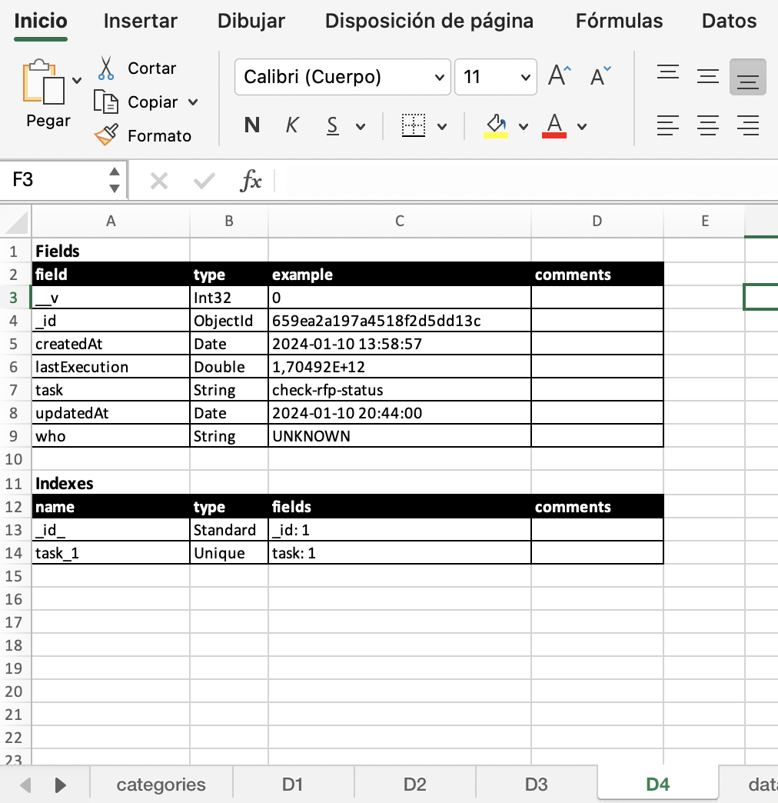

# MongoDB Documentation Generator

## Descripción
Este script de Python genera automáticamente un archivo de documentación en formato Excel para las colecciones en una base de datos MongoDB. Analiza las colecciones de la base de datos especificada, extrayendo información sobre los campos, tipos de datos y ejemplos de valores, y luego organiza esta información en un archivo Excel estructurado y legible.

## Características
- Conexión a cualquier base de datos MongoDB especificada.
- Generación de una hoja de cálculo por cada colección en la base de datos.
- Documentación de campos con detalles como nombre del campo, tipo de dato, ejemplo de valor y un espacio para comentarios.
- Formato estilizado en Excel para mejorar la legibilidad.

## Ejemplo de resultado


## Requisitos
Para ejecutar este script, necesitarás:
- Python 3.x
- Bibliotecas de Python: pymongo, pandas, openpyxl

## Uso
Para utilizar este script, sigue estos pasos:

1. Instalación de Dependencias:
   Asegúrate de tener instaladas las bibliotecas necesarias con el comando 
   ```bash
   pip install pymongo pandas openpyxl.
   ```
2. Ejecución del Script:
   Ejecuta el script desde la línea de comandos, proporcionando el nombre de la base de datos y, opcionalmente, el string de conexión y el nombre del archivo de salida.

   Ejemplo de uso básico:
   ```bash
   python script.py nombre_base_de_datos
   ```
   Ejemplo de uso completo:
   ```bash
   python script.py nombre_base_de_datos --connection_string tu_string_de_conexion --output nombre_archivo.xlsx
   ```

   donde:
   - nombre_base_de_datos es el nombre de tu base de datos en MongoDB.
   - tu_string_de_conexion es tu string de conexión a MongoDB. El valor predeterminado es mongodb://localhost:27017.
   - nombre_archivo.xlsx es el nombre deseado para el archivo de salida. El valor predeterminado es mongo-doc.xlsx.

## Notas Adicionales
- Asegúrate de que MongoDB esté accesible en la dirección especificada por el string de conexión.
- Puedes modificar el script para adaptarlo a necesidades específicas, como cambiar el formato del archivo Excel o ajustar la cantidad de datos analizados por colección.
